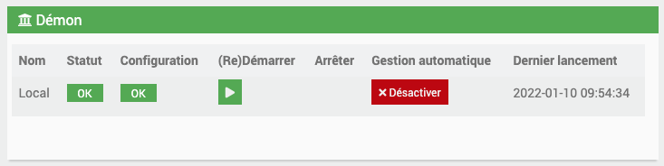

# Modbus

## Description

Plugin permettant de lire et écrire sur vos équipements Modbus TCP/IP et RTU. Actuellement, il n'est pas compatible avec les équipements Wago.

## Configuration du plugin

Après le téléchargement du plugin, activez-le comme n'importe quel plugin Jeedom :

Lancez ensuite l'installation des dépendances (même si le statut affiché est OK) :

Puis, démarrez le démon :

Il n'est pas nécessaire de modifier le champ « Port socket interne » dans la section « Configuration ».

Dans cet onglet, vous devez choisir le délai de repos entre chaque actualisation de vos équipements (5 secondes par défaut).

Vous avez également la possibilité d'activer une option de réessai pour les commandes ou équipements en erreur (désactivée par défaut). Vous pouvez choisir le nombre de tentatives et le délai entre ces tentatives.

### :warning: Choix du niveau de log de la librairie Modbus

Par défaut, le niveau de log est configuré sur ERROR, car la librairie peut être verbeuse. Vous pouvez modifier ce niveau. N'oubliez pas de sauvegarder vos modifications et de redémarrer le démon.

# Utilisation du plugin Modbus

## Informations importantes

Avant d'utiliser le plugin, assurez-vous de connaître les paramètres des entrées/sorties de vos périphériques Modbus (format des données, ordre des bits, etc.).

### Configuration des commandes

Lors de la création de commandes, certains paramètres doivent être sélectionnés :

- **Format de valeur attentue** : Il vous faudra obligatoirement choisir un format de valeur attentue, spécifiée habituellement sur votre table de registres.
- **Offset** : Prend en compte le décalage dans les numéros de registre sur certains équipements Modbus.
- **Pas du slider** : Déterminez le pas du slider pour les commandes de type Action/Slider, permettant d'envoyer des valeurs non entières.

## Exportation et importation des commandes

Il est possible d'exporter les commandes d'un équipement déjà configuré en fichier `.json`. Cela facilite la réutilisation des configurations sur d'autres équipements ou box.

### Exportation des commandes

1. Sur la page de l'équipement, trouvez l'encart en bas à droite pour l'exportation.
   
2. Cliquez sur **Liste des commandes à exporter**. Sélectionnez les commandes souhaitées.
   
3. Après sélection, cliquez sur **Valider** pour préparer l'exportation.
   
4. Cliquez sur **Télécharger Config des commandes** pour sauvegarder le fichier `.json`.

### Importation des commandes

Pour importer des commandes sur un nouvel équipement :

1. Cliquez sur le bouton **Import Json** situé en haut à droite de la page de l'équipement.
   

Ces étapes permettent une gestion efficace des configurations de vos équipements Modbus.

## Sélection d'un modèle d'équipement

Vous pouvez charger des commandes prédéfinies en sélectionnant un modèle d'équipement disponible dans la configuration du plugin :

1. Sélectionnez le modèle désiré.
2. Cliquez sur **Valider**.
3. N'oubliez pas de **Sauvegarder** vos modifications.

## Détails sur Modbus

Un registre Modbus a une taille de 16 bits (2 octets).

## Commandes de lecture

### Entrées Coils (FC01)

Pour lire les entrées Coils :

1. Ajoutez une nouvelle commande Modbus et nommez-la.
2. Sélectionnez le type **Info**, sous-type **Binaire** ou **Numérique**.
3. Utilisez le code de fonction **FC01**.
4. Spécifiez le registre de départ et le nombre de registres à lire.
   - À la sauvegarde, autant de commandes que le nombre de registres spécifiés seront créées (ex: `ReadCoil_1`, `ReadCoil_2`, etc.).
5. Vous pouvez renommer ces commandes par la suite.

### Lecture Discrete Inputs (FC02)

Pour lire les entrées discrètes :

1. Créez une commande de type **Info**, sous-type **Autre**.
2. Sélectionnez **FC02**.
3. Choisissez le format **Bits**, **Big Endian**, **Big Word**.
4. Renseignez le registre de départ.
5. Indiquez le nombre de bits à lire (0 à 15).

La commande retournera une chaîne de caractères avec la valeur des bits lus.

### Holdings et Inputs Registers (FC03, FC04)

Pour ces registres :

1. Ajoutez une nouvelle commande Modbus et nommez-la.
2. Sélectionnez le type **Info**, sous-type **Numérique**.
3. Choisissez le format approprié (**Float**, **Long/Integer**, ou **Bits**).
4. Utilisez le code de fonction **FC03** ou **FC04** pour spécifier le registre de départ et le nombre de registres à lire.
   - Pour les **Floats**, la valeur est encodée sur 2 à 4 registres.

## Commandes d'écriture

Par défaut, trois commandes d'action/message sont créées sur votre équipement :

- Écriture MultiRegistre
- Écriture Bit
- Écriture MultiCoils

### Nouvelle méthode d'écriture sur un bit

Pour modifier un bit spécifique :

1. Créez une commande de type **Action** avec la fonction **Écriture Bit**.
2. Remplissez les champs **Registre de départ** et **Position du bit**.
   - À la sauvegarde, deux commandes d'action seront créées (`EcritureBit_Registre_Position_1` et `EcritureBit_Registre_Position_0`), et la commande initiale sera supprimée.

 

CHANGEMENT DE BITS D'UN REGISTRE (Ancienne méthode) :

Pour changer le bit d'un registre, utilisez la commande `EcritureBit`. Dans la configuration de la commande, choisissez le numéro du registre à écrire dans le champ "Registre de départ". Aucune autre configuration n'est nécessaire. Dans le corps du message de la commande sur le dashboard, utilisez la syntaxe suivante : `valeurBit&indexBit&Registre`
- `valeurBit` peut être 0 ou 1.
- `indexBit` est une valeur entre 0 et 15 (inclus).
Référez-vous à la documentation de votre équipement pour l'index du bit à changer.

NOUVELLE ÉCRITURE SUR PLUSIEURS REGISTRES À UNE REQUÊTE :

- En créant une commande `Action` -> sous-type `Autre`, puis en choisissant `Fc16`, et en remplissant le `Start Register` et la ligne `Tableau Registre` dans le paramétrage de la commande, vous pouvez exécuter cette commande pour écrire à partir du registre de départ les valeurs entrées :

Exemple :
- `Start Register` : 10
- `Ligne Tableau Registre` : 10-45-22-25.6-2360
Les valeurs 10, 45, 22, 25.6 et 2360 seront envoyées sur les registres 10, 11, 12, 13 et 14 respectivement. Séparez les valeurs par un `-`, et pour les nombres décimaux, utilisez un `.`.

Écriture MultiRegistre :
Dans la configuration de la commande, entrez le registre de départ, ainsi que l'ordre des bytes et des mots. Le `fonctionCode` est par défaut `fc16`. Laissez cette configuration par défaut.

Pour changer les valeurs sur les registres, utilisez cette syntaxe :
`valeuraenvoyer&nbderegistre`, séparé par `|` : Ex : `120&1|214.5&4`
Cela envoie l'entier 120 sur un registre, en partant du registre de départ configuré, puis 214.5 en float sur 4 registres suivant le précédent.

Pour les types float, écrivez la valeur comme ci-dessus, avec un `.`.

Écriture MultiCoils :
Dans la configuration de la commande, entrez le registre de départ. Le `fonctionCode` est par défaut `fc15`. Laissez cette configuration par défaut.

Pour changer les valeurs sur les registres, utilisez cette syntaxe :
Ex : `01110111` Cela enverra à partir du registre de départ configuré les valeurs True (1) ou False (0) aux registres.

Écriture Bit :
Dans la configuration de la commande, entrez le registre de départ, ainsi que l'ordre des bytes et des mots. Le `fonctionCode` est par défaut `fc03`, car cette commande sera à donner la valeur du registre paramétré en binaire à la commande info `infobitbinary`.

Laissez cette configuration par défaut.

Sur la commande info `infobitbinary`, vous aurez la valeur binaire du registre paramètre à la commande Écriture Bit. Pour changer le bit sur le registre :

`valeuraenvoyer&PositionBit` : Ex : `1&4` Nous envoyons la valeur 1 au bit de la position 4 en partant de la droite. Sur la commande info `infobitbinary`, vous voyez la valeur `10000101`, qui correspond à la valeur binaire du registre paramètre. En écrivant `1&6`, vous aurez désormais la valeur `10100101` sur le registre paramétré.

IMPORTANT :

Certains automates n'ont pas la fonction `fc06`. Voir Paramètres spécifiques en fin de documentation.

Pour écrire sur un Coil :

Exemple pour le registre 1 On :
- Ajoutez une Nouvelle Commande Modbus, nommez la commande. Choisissez une commande de type `Action`, sous-type `Défaut`.
- Choisissez `Fc5 Write Single Coil`.
- `Registre de départ` : 1
- `Nb de bytes` : 1
- Mettez 1 dans `valeur à envoyer`.

Exemple pour le registre 1 Off :
- Ajoutez une Nouvelle Commande Modbus, nommez la commande. Choisissez une commande de type `Action`, sous-type `Défaut`.
- Choisissez `Fc5 Write Single Coil`.
- `Registre de départ` : 1
- `Nb de bytes` : 1
- Mettez 0 dans `valeur à envoyer`.

En agissant sur ces commandes action sur votre dashboard, vous enverrez donc True ou False à vos Coils.

Pour écrire sur un Holding Register :

- Ajoutez une Nouvelle Commande Modbus, nommez la commande. Choisissez une commande de type `Action`, sous-type `Slider`.
- Choisissez aussi une valeur Min et Max pour ce slider (pensez à prendre une valeur min pour envoyer valeur négative).
- Choisissez `Fc6 Write Single Register`.
- Choisissez le nombre de registre : 1.
- Choisissez le pas du slider (pour les décimales, écrivez avec un `.` ex : `0.2`).

Quand une écriture s'effectue, que cela réussisse ou non, un message apparaît sur Jeedom. Vous pouvez désactiver/activer ce message depuis la configuration du plugin.

# Paramètres Spécifiques

RETOUR HEXA :
Pour avoir une commande qui retourne la valeur du registre en HexaDecimal (pour une commande qui remonte les erreurs d'un équipement par exemple), créez votre commande, paramétrez-la comme habituellement, et cochez `Retour Hexa`.

Cela créera au retour d'état une nouvelle commande qui portera le nom de la commande originale, suivi de `_HEXAVALUE`.

LECTURE MULTIREGISTRES :
En cochant `LectureMultiRegistres`, cela va créer automatiquement autant de nouvelles commandes que le nombre précisé dans `Nombre de registre`, reprenant le nom de la commande originale, plus l'id de la commande en itération. Vous pouvez bien entendu renommer les commandes; à la lecture de la commande originale, sa valeur contiendra une chaîne de caractère des 10 valeurs des registres, et mettra à jour les 10 commandes correspondantes.

Fc16 REGISTRES NON SUIVIS :
Certains automates n'ont pas la fonction `fc06`. Vous pouvez créer une commande `Action`, sous-type `Message`, et choisir `fc16`. Cochez `Fc16 Registre non suivis`. Dans le dashboard, utilisez cette syntaxe : `registre de départ ! valeur & nbregistres` séparé par un `|`.

Ex : `7!122.5&2|10!22&2`

On va écrire à partir du registre 7, la valeur 122.5 sur 2 registres et également à partir du registre 10, la valeur 22, sur 2 registres.

OPÉRATION SUR COMMANDE :
Pour une opération sur le retour de valeur : dans le champ `Opération sur la commande`, vous pouvez remplir une opération mathématique en mettant le tag `#value#` pour indiquer la valeur de cette commande :
exemple : `(#value# / 10 ) * 2`
Le calcul sera effectué sur le retour de data de cette commande. Bien utiliser `*` pour les multiplications.

# Import/Export Commandes XLSX

Après la création d'un équipement, vous pouvez importer un fichier xlsx pour la création de vos commandes. Le fichier template se trouve dans `plugins/modbus/data/templateXlsx/exportModbus.xls`. Vous pouvez y accéder et le télécharger via votre Jeedom -> Réglages->Système->Éditeur de fichiers.